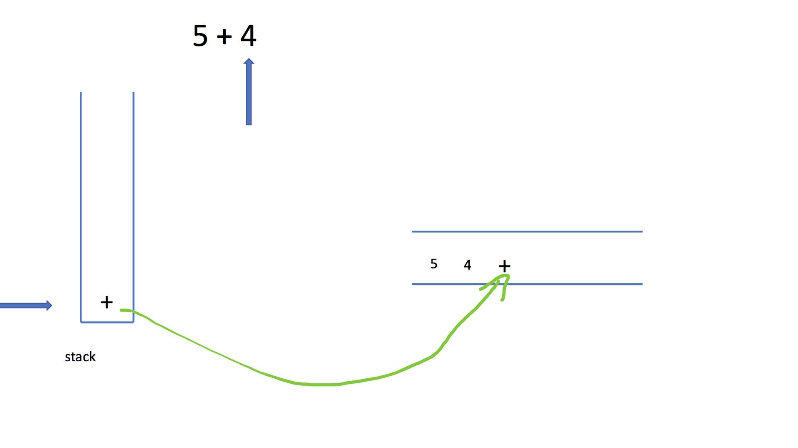

 - 计算器中的表达式 是如何 运算的？ 
    什么是 前缀表达式 
    什么是中缀表达式
    什么是后缀表达式
    为啥需要前缀表达式，后缀表达式 ？ 
    如何将中缀表达式转化为 后缀表达式呢？
    后缀表达式如何计算的 ？ 
    150. 逆波兰表达式求值


# 计算器中的表达式 是如何 运算的？ 

前缀表达式 ， 中缀表达式  后缀表达式 


## 什么是 前缀表达式 

前序表达式就是[前缀表达式](https://baike.baidu.com/item/前缀表达式/5461072) ，不含括号的 [算术表达式](https://baike.baidu.com/item/算术表达式/352084) ，
而且它是将[运算符](https://baike.baidu.com/item/运算符/7752795)  写在前面，操作数写在后面的[表达式](https://baike.baidu.com/item/表达式/7655228) ，也称为 [波兰式](https://baike.baidu.com/item/波兰式/3716632) 。


举个例子： 

`*,3, 4  --> 3 * 4 `

`3*4+5     -->  *,3,4,+5 `

`a+(b-c)*d --->    +,a,*,-,b,c,d`

`a+(b-c) ---> +,a,-,b,c`

看上面的例子 就是运算符 写在 数字的前面的一种表达式， 这样 我们看起来 很不舒服，我们人类比较喜欢的 方式 是 中缀表达式。 


## 什么是中缀表达式

中缀表达式： 运算符写在 操作数的中间的一种算术表示式 ,）是一个通用的算术或逻辑公式表示方法， 操作符是以中缀形式处于操作数的中间（例：3 + 4），中缀表达式是人们常用的算术表示方法.

`1+2 *3 `

`3*5-5+2`


## 什么是后缀表达式

逆波兰式（Reverse Polish notation，RPN，或逆波兰记法），也叫后缀表达式

相对于前缀表达式，后缀表达式操作符 写在后面就是后缀表达式。 

`a,b,+,c,*,d,-    --> （a+b）*c-d`   


## 为啥需要前缀表达式，后缀表达式 ？ 


对于 人类而言 比较喜欢中缀表达式， 直接就可以计算结果 

` 2*3+5-2`    我相信你肯定很容易算出来这个结果 9 ， 但是对于计算机来说  这样的表达式 计算 是不太知道如何计算的？   

计算机擅长的动作是 做一个重复性的操作， 比如 循环，递归等。  所以 人类发明了一种表示式 后缀表达式，比如 现在 上面的表达式 


我们 可以先转成后缀表达式 ，在进行计算 就好了, 

假设我们已经能够把一个表达式转成 后缀表达式了，  

```python
expressions = ["2", "3", "*", "5", "+", "2","-"]
```

如果我们 把中缀表达式转化为 后缀表达式， 我们 就可以比较轻易通过计算机的方式计算了，

首先 使用栈 这种数据结构， 从左向右扫描 这个表示式 ，如果遇到 是数字直接入栈， 如果是操作符取出栈中的两个数字 进行计算， 计算完成后，把 结果放入栈中，依次 这样操作 最终的结果 就是 这个表达式的值了。


​		首先 栈中 没有元素

2 ,3 依次入栈， 遇到 * 后， 栈中依次出栈 3 ，2， 然后 用 2 *3 计算结果6 放入栈中， 

此时栈中 有6， 继续入栈 5  ，  遇到+ 后，    依次出栈 5，6   然后用 6 + 5 计算结果 11 放入 栈中 ，

继续 2 进栈，  遇到- 后 依次出栈 两个元素  2， 11 ， 然后用 11 -2  计算结果 9 放入栈中， 

最后 表达式遍历 完毕 ，结果 就计算出来了。  结果是 栈顶的元素 9 


## 如何将中缀表达式转化为 后缀表达式呢？


算法 思想  : 


首先 依次 遍历中缀表达式，

如果是数字 直接输出

如果是符号： 

​		左括号， 直接进栈

​		运算符， 与栈顶元素 进行比较如果  栈顶元素 优先级较低， 直接入栈即可。

​						如果栈顶元素 优先级较高，将栈顶元素 弹出 并输出。 之后进栈即可。

​		右括号， 将栈中的元素依次弹出 直到遇到左括号。

遍历结束后，如果栈中还有元素依次弹出并输出 即可。 


注意： 左括号优先级 最低


定义一个栈,和一个 result 的list 

举个例子 来看下 


```bash
5 + 4   -->   5  4 + 

1 + 2 *3   -->   1 2 3 * + 

8 +（3-1） * 5      -->   8 3 1 - 5 * + 
```


第一步：

遍历表达式 如果是5 ， 数字 直接输出， 然后 第二个是运算符，直接进栈


继续遍历表达式：

数字4 直接 输出即可。


最后 遍历完表达式了，把栈中元素 依次弹出即可。最终 后缀表达式 为  5 4  + 




来看一个 更加复杂的例子

>  8 +（3-1） * 5 


我写了一下代码,仅供参考吧


```python

import string
from typing import List

# 数字字符串
numbers = set(string.digits)

# 运算符
operators = {'+', '-', '*', '/', '('}

# 小括号,左括号
parenthesis = {'(': ')'}

# 数字越小，优先级越高， 1 为最高优先级， 2 次之，3 优先级最低
priority = {
    '+': 2,
    '-': 2,
    '(': 3,
    '*': 1,
    '/': 1,
}


class Solution:

    def convert_suffix(self, tokens: List):
        stack = []
        results = []

        for t in tokens:
            if t in numbers:
                results.append(t)
            elif t in parenthesis:
                # 对于左括号直接入栈 即可
                stack.append(t)
            elif t in operators:
                if stack:
                    # 栈顶的元素优先级低，直接入栈 即可。
                    if priority[stack[-1]] >= priority[t]:
                        stack.append(t)
                    else:
                        results.append(stack.pop())
                else:
                    # 栈为空的情况
                    stack.append(t)
            else:
                # ) 右括号的情况
                while stack:
                    item = stack.pop()
                    if item in parenthesis:
                        break
                    results.append(item)

        # 把栈中 所有的运算符依次放入结果中 即可
        while stack:
            results.append(stack.pop())

        return results


if __name__ == '__main__':
    # tokens = ["5", "+", "4"]

    # 1 + 2 *3
    # tokens = ["1", "+", "2", "*", "3"]
    # 8 +（3-1） * 5

    tokens = ["8", "+", "(", "3", "-", "1", ")", "*", "5"]

    r = Solution().convert_suffix(tokens=tokens)
    print(r)

```


通过上面的方法，就可以把 一个中缀表达式 转化为后缀表达式。 有了后缀表达式，我们就可以方便计算 一个表达式了。


## 后缀表达式如何计算的 ？ 


直接看一道 题目： 

该题目来自 leetcode150题 

## [150. 逆波兰表达式求值](https://leetcode-cn.com/problems/evaluate-reverse-polish-notation/)

根据[ 逆波兰表示法](https://baike.baidu.com/item/逆波兰式/128437)，求表达式的值。

有效的运算符包括 `+`, `-`, `*`, `/` 。每个运算对象可以是整数，也可以是另一个逆波兰表达式。

 

**说明：**

- 整数除法只保留整数部分。
- 给定逆波兰表达式总是有效的。换句话说，表达式总会得出有效数值且不存在除数为 0 的情况。

 

**示例 1：**

```
输入: ["2", "1", "+", "3", "*"]
输出: 9
解释: 该算式转化为常见的中缀算术表达式为：((2 + 1) * 3) = 9
```

**示例 2：**

```
输入: ["4", "13", "5", "/", "+"]
输出: 6
解释: 该算式转化为常见的中缀算术表达式为：(4 + (13 / 5)) = 6
```


我们来分析一下 题目该如何计算呢？   根据后缀表达式的特点， 运算符在操作数的前面 我们需要找到这个操作符对应的两个操作是什么？  

 如何找到呢？ 其实比较 容易 想到的方法 是 使用栈，

 step1: 如果是 数字就直接进栈，

step2 如果是运算符那么取出栈中的两个元素 进行运算 ，把 运算结果 放回栈中，

继续扫描 表达值，继续判断重复 step1 , step2 

 最后栈顶元素 就是我们要求的值了啦。


```python3

from typing import List


class Solution:
    def evalRPN(self, tokens: List[str]) -> int:
        operators = {"+", "-", "*", "/"}

        # 用list 来 模拟栈
        stack = []

        for t in tokens:
            if t not in operators:
                stack.append(t)
            else:
                n1 = stack.pop()
                n2 = stack.pop()

                # 需要用整除的情况，特殊处理一下。
                if t == '/':
                    t = '//'
                r = eval(n2 + t + n1)
                # 计算结果放入栈中
                stack.append(str(r))
            # 最后 返回栈顶元素
        return int(stack.pop())


if __name__ == '__main__':
    tokens = ["2", "1", "+", "3", "*"]
    r = Solution().evalRPN(tokens=tokens)
    print(r)

```


## 参考文档

[百度百科: 前序表达式](https://baike.baidu.com/item/%E5%89%8D%E5%BA%8F%E8%A1%A8%E8%BE%BE%E5%BC%8F)


[百度百科: 中缀表达式](https://baike.baidu.com/item/%E4%B8%AD%E7%BC%80%E8%A1%A8%E8%BE%BE%E5%BC%8F
)

[前、中、后缀表达式](https://zhuanlan.zhihu.com/p/75890992)  

[150. 逆波兰表达式求值](https://leetcode-cn.com/problems/evaluate-reverse-polish-notation/)


[面试题 16.26. 计算器](https://leetcode-cn.com/problems/calculator-lcci/)


<center>  
    <font color=gray size=1 face="黑体">
       分享快乐,留住感动.2020-09-20 22:25:17 --frank 
    </font>
</center>