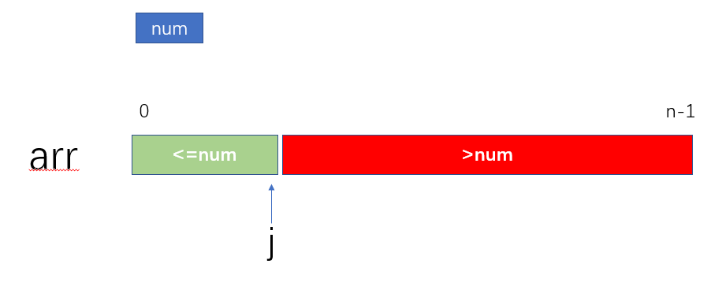
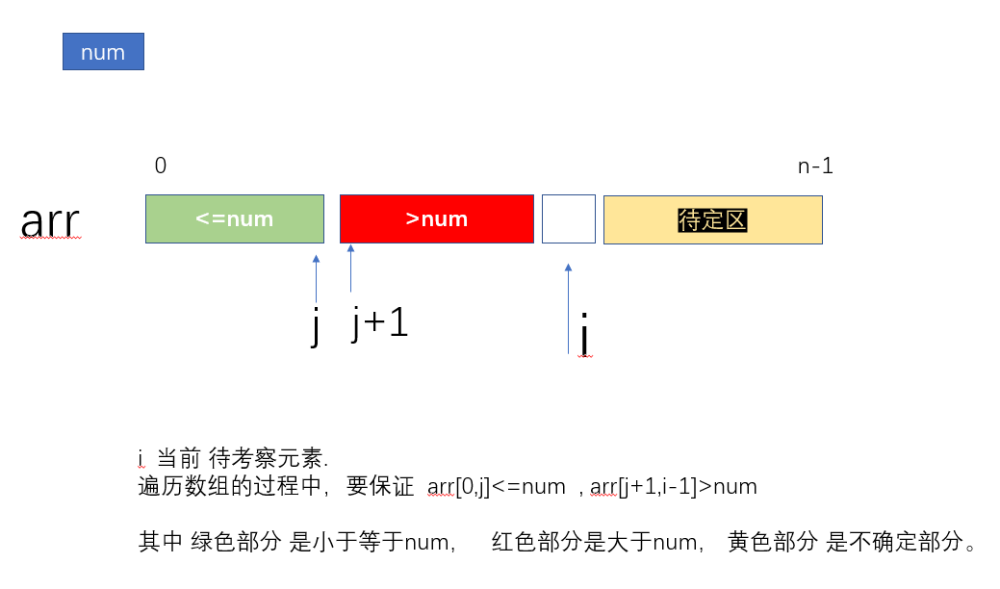
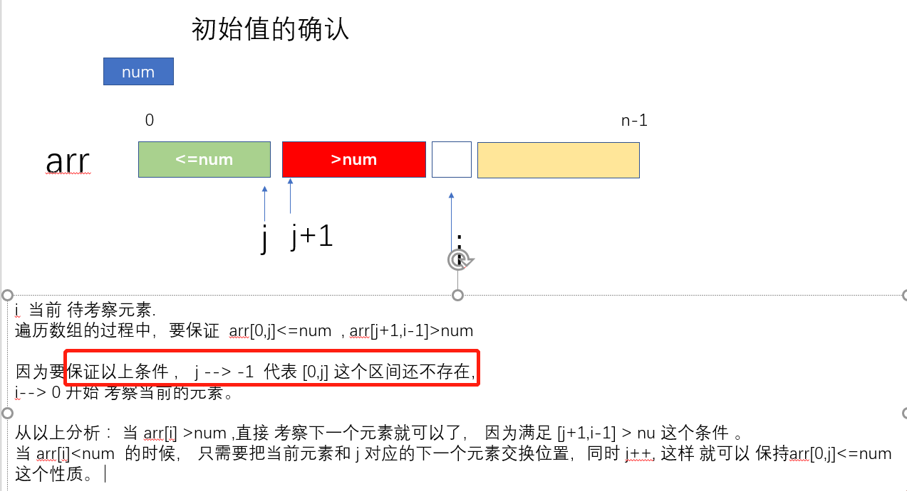
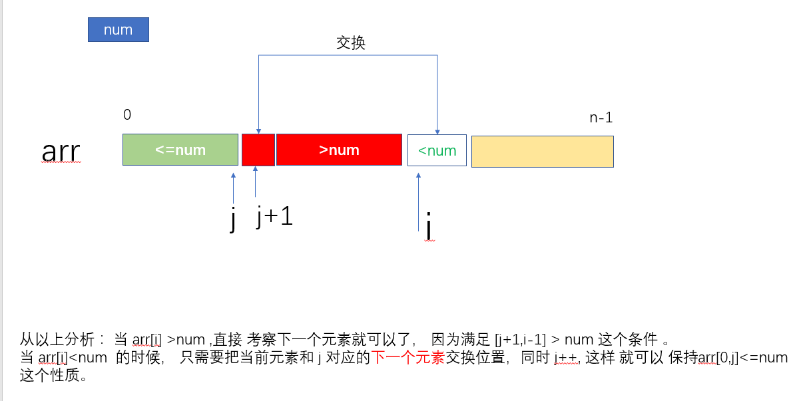

# partition 过程详解

## 介绍  
给定一个数组arr，和一个数num， 请把小于等于num的数放在数
组的左边， 大于num的数放在数组的右边。要求额外空间复杂度O(1)， 时间复杂度O(N)


简单来说 把一个数组 分成如下图




### 思路如下：

1. i当前 待考察元素. 
遍历数组的过程中，要保证 arr[0,j]<=num , arr[j+1,i-1]>num 

其中 绿色部分 是小于等于num, 红色部分是大于num, 黄色部分 是不确定部分



如果当前 i 位置的元素 大于 num , 直接考察下一个元素 即可 。 如果 当前的元素小于num 的时候， 
就要把 当前位置的元素 的 j的下一个位置j+1 交换 , 同时 小于等于区域 要往后扩大一个位置，即j++ 
这样就可以保证了 以上的性质 arr[0,j]<=num 这个性质成立， arr[j+1,i-1]>num 也是成立的。


2.考虑初始值情况 
一开始小于等于区域应该是没有 所以把j=-1,代表区域不存在。



3.经过以上分析，其实只要看，arr[i]<=num，如果小于就要和 小于等于区域的下一个位置交换，同时小于等于区域扩大一个位置 。



```c++

template<typename T>
int partition(T arr[], int n, int num) {

    int j;
    j = -1;
    //arr[0,j] <=num , arr[j+1,i) > num
    for (int i = 0; i < n; i++) {

        if (arr[i] <= num) {
            j++;
            swap(arr[i], arr[j]);

        } else {
            // arr[i] >num
            // do nothing
        }

    }
    return j;
}

```